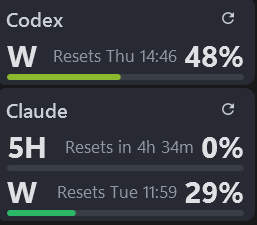

# AI Usage Monitor

AI Usage Monitor is a compact, always-on-top Windows desktop widget for monitoring subscription usage across OpenAI Codex and Claude Code. It displays used quota, reset times, and provider state without requiring a browser dashboard.



## Features

- OpenAI Codex weekly usage
- Claude Code current five-hour session and weekly usage
- Used-percentage progress bars with configurable five-stage colours and cutoffs
- Compact reset-time labels with exact reset times in tooltips
- Manual refresh plus optional scheduled and hook-triggered refresh
- Optional Codex and Claude Code Stop hooks for automatic refresh after a session
- Automatic refresh disabled by default, with independent Codex and Claude intervals
- Five-minute non-manual refresh throttle to reduce rate-limit errors
- Cached last-known usage and update times across restarts
- Vertical or side-by-side provider layout with a 2 px horizontal gap
- Independently show or hide Codex and Claude
- Five text-size presets from Compact to Extra Large
- Developer-only 512 × 512 icon screenshot preview with large text and reset labels hidden (`Ctrl+Alt+D` in Settings)
- Borderless, translucent, always-on-top widget
- Movable and resizable window with a shared lock setting
- Remembered position, size, opacity, layout, visibility, typography, and usage stages
- System-tray and widget context menus for Settings, Refresh All, and window controls
- Single-instance handling for hook notifications

The displayed percentages are **used percentages**: a larger value and longer bar mean more of the quota has been consumed.

## Requirements

To run the published application:

- Windows 10 or Windows 11, x64
- OpenAI Codex installed and signed in for Codex usage
- Claude Code installed and signed in for Claude usage
- Internet access to the relevant provider services

To build from source:

- [.NET 10 SDK](https://dotnet.microsoft.com/download/dotnet/10.0)
- Visual Studio 2022 or later with the .NET desktop development workload, or the `dotnet` CLI

## Build and run

Clone the repository and build the solution:

```powershell
git clone https://github.com/ansonliam/AIUsageMonitor.git
cd AIUsageMonitor
dotnet build .\AIUsageMonitor.sln -c Release
```

Run from source:

```powershell
dotnet run --project .\src\AIUsageMonitor\AIUsageMonitor.csproj -c Release
```

Create a self-contained, single-file Windows build:

```powershell
dotnet publish .\src\AIUsageMonitor\AIUsageMonitor.csproj `
  -c Release `
  -r win-x64 `
  --self-contained true `
  -p:PublishSingleFile=true `
  -p:EnableCompressionInSingleFile=true `
  -o .\dist
```

## Configuration and setup

1. Install and sign in to Codex and/or Claude Code.
2. Start AI Usage Monitor.
3. When prompted, choose whether to install the missing automatic-refresh hooks.
4. Right-click the widget or tray icon to open **Settings**.
5. Enable **Automatic refresh** if wanted and choose separate Codex and Claude intervals.
6. Use Settings to install, repair, uninstall, test, or inspect each provider hook.
7. Choose the provider layout, visible cards, text size, colours, cutoff percentages, opacity, and window lock state.

Hook installation and removal preserve unrelated provider settings and hooks. New handlers carry the unique owner marker `com.ansonliam.ai-usage-monitor`; executable-specific legacy handlers are migrated during repair.

Hooks contain the absolute path of the executable. After moving or renaming a portable copy, use **Settings → Install / Repair Hook** for both providers. Otherwise, the provider may continue invoking an older path.

## Local data and privacy

AI Usage Monitor does not place provider credentials in this repository or its own settings file.

- Widget settings: `%LOCALAPPDATA%\AIUsageMonitor\window-placement.json`
- Last-known usage cache: `%LOCALAPPDATA%\AIUsageMonitor\usage-cache.json`
- Codex hook: `%USERPROFILE%\.codex\hooks.json`
- Claude hook: `%USERPROFILE%\.claude\settings.json`, or the directory selected by `CLAUDE_CONFIG_DIR`

Codex authentication is accessed through the locally installed Codex app-server. Claude authentication uses the existing Claude Code credential cache; when required, the application follows the Claude OAuth refresh flow and updates the relevant credential fields in that existing cache.

Do not commit runtime caches, provider configuration, credential files, or locally published binaries. The repository `.gitignore` excludes these files and directories.

## Refresh behavior

- **Manual refresh** always requests fresh data.
- **Automatic refresh** is disabled by default.
- **Scheduled refresh intervals** are configured separately for Codex and Claude from 5 to 1440 minutes.
- **Hook and scheduled refreshes** are limited to one provider request per five minutes.
- Claude `429 Too Many Requests` responses respect `Retry-After` when present and otherwise use capped exponential backoff.

## Screenshots

The screenshot above shows the compact vertical layout. The same provider cards can be arranged side by side, resized, recoloured, or displayed individually.

## Known limitations

- Windows-only WPF application; no macOS or Linux build is currently provided.
- Provider APIs, local credential formats, and app-server contracts are not guaranteed public interfaces and may change.
- Hook paths are absolute, so portable copies require hook repair after being moved or renamed.
- Cached values may be shown until the next successful refresh.
- Hook-triggered refresh is throttled and is not intended as second-by-second monitoring.
- CSV history, alerts, and usage notifications are not currently implemented.
- The application has no automated test project yet; release verification currently relies on a clean solution build and runtime checks.

## License

AI Usage Monitor is available under the [MIT License](LICENSE).
