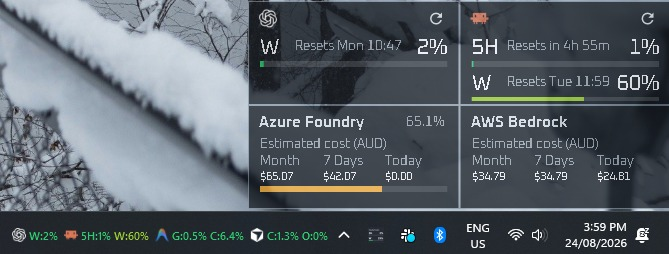

# AI Usage Monitor

AI Usage Monitor is a compact, always-on-top Windows desktop widget for monitoring subscription usage across OpenAI Codex, Claude Code, Google Antigravity, and Cursor. It displays used quota, reset times, and provider state without requiring a browser dashboard.



## Download

Download the newest automatic Windows x64 build from [GitHub Releases](https://github.com/ansonliam/AIUsageMonitor/releases/latest), or download the executable directly:

- [AIUsageMonitor.exe](https://github.com/ansonliam/AIUsageMonitor/releases/latest/download/AIUsageMonitor.exe)
- [SHA-256 checksum](https://github.com/ansonliam/AIUsageMonitor/releases/latest/download/AIUsageMonitor.exe.sha256)

The release is a self-contained single-file application and does not require a separate .NET installation. It is currently unsigned, so Windows SmartScreen may display an **Unknown publisher** warning.

## Features

### Usage

- Shows usage windows, reset times, and provider status
- Supports Codex, Claude Code, Antigravity, and Cursor
- Refreshes manually, on a schedule, while idle, or through optional provider hooks
- Caches the last-known values between restarts

### Widget

- Compact, translucent, always-on-top design
- Vertical or side-by-side provider cards
- Customisable provider visibility, text size, colours, opacity, and window position
- System-tray controls and optional automatic refresh hooks
- Optional taskbar widget: a compact, independent strip that floats beside the system tray icons and clock, with its own per-provider visibility and a hover tooltip showing status, last updated, and reset times

## Requirements

To run the published application:

- Windows 10 or Windows 11, x64
- OpenAI Codex installed and signed in for Codex usage
- Claude Code installed and signed in for Claude usage
- Google Antigravity 2.0 desktop installed, signed in, and running for Antigravity usage
- Cursor installed and signed in for Cursor usage
- Internet access to the relevant provider services

To build from source:

- [.NET 10 SDK](https://dotnet.microsoft.com/download/dotnet/10.0)
- Visual Studio 2022 or later with the .NET desktop development workload, or the `dotnet` CLI

## Build and run

Clone the repository and build the solution:

```powershell
git clone https://github.com/ansonliam/AIUsageMonitor.git
cd AIUsageMonitor
dotnet build .\AIUsageMonitor.slnx -c Release
```

Run from source:

```powershell
dotnet run --project .\src\AIUsageMonitor\AIUsageMonitor.csproj -c Release
```

Create a self-contained, single-file Windows build:

```powershell
dotnet publish .\src\AIUsageMonitor\AIUsageMonitor.csproj `
  -c Release `
  -r win-x64 `
  --self-contained true `
  -p:PublishSingleFile=true `
  -p:EnableCompressionInSingleFile=true `
  -o .\dist
```

## Configuration and setup

1. Install and sign in to any providers you want to monitor. Keep Antigravity running while its quota is read.
2. Start AI Usage Monitor.
3. When prompted, choose whether to install the missing automatic-refresh hooks.
4. Right-click the widget or tray icon to open **Settings**.
5. Adjust refresh, provider, and appearance settings as needed.

If the portable executable is moved, repair the optional hooks from Settings.

Claude may return a “too many requests” response if refreshed too frequently. A one-minute refresh interval is a good starting point.

## Privacy

AI Usage Monitor uses the credentials already stored by each provider. It does not request separate API keys or include provider credentials in its own settings or cache.

## Screenshots

The screenshot above shows the optional taskbar widget floating beside the system tray. Open **Settings** to choose the providers, appearance, and taskbar visibility that suit you.

## Known limitations

- Windows only
- Antigravity requires the desktop application to be running
- Cached values may remain visible until the next successful refresh
- Releases are not code-signed and may trigger a Windows SmartScreen warning

## License

AI Usage Monitor is available under the [MIT License](LICENSE).
